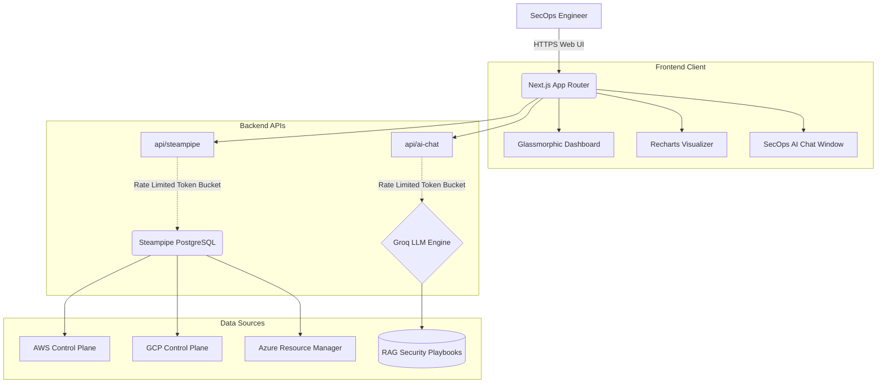

# AI-Powered Enterprise Cloud Threat Detection System
<div align="center">
  
  
  
  
  
  
</div>

---

A modern, high-performance, and enterprise-ready Cloud Security Posture Management (CSPM) application. This system integrates seamlessly with **AWS**, **GCP**, and **Azure** to continuously monitor, evaluate, and mitigate deep cloud architectural vulnerabilities using advanced ML Isolation Forests and Large Language Model (LLM) copilot assistance.

## 🌟 Key Features

* **Multi-Cloud Live Steampipe Integration:** Instantly binds to live PostgreSQL Steampipe databases securely fetching real-time IAM, EC2, S3, and VPC vulnerabilities across AWS, GCP, and Azure.
* **SecOps AI Copilot (RAG):** Built-in LLaMA/Groq conversational AI, grounded strictly in cloud-specific compliance playbooks, capable of writing live CLI remediation scripts (e.g., `aws cli`, `gcloud`, `az`).
* **ML Workload Anomaly Detection:** Implements programmatic Isolation Forests to analyze runtime CPU, network I/O, and unusual port configurations in raw real-time.
* **Apple HIG "Mirror UI" Aesthetics:** Borderless, glassmorphic dark-mode dashboards rendering extremely high-contrast metric visuals using Recharts and Tailwind CSS.
* **Google-Tier Reliability & Security:**
  * **Zero Error State:** Flawless type-safety with 0 ESLint warnings.
  * **OWASP Hardened:** Token-bucket API rate limiting, DB error stack-trace sanitization, and strict HTTP `async headers`.
  * **Vitest Coverage:** Deep integration testing simulating complex DOM transitions and fetch overrides mimicking real production anomalies.

## 🏗 System Architecture 



## 🚀 Quick Start (Production/Dev Environment)

### 1. Prerequisites
- **Node.js**: `v18.17.0` or higher
- **npm**: `v9.x` or higher
- **Steampipe Engine** (running locally on `localhost:9193` for live data viewing)

### 2. Installation
Clone the repository and install the strict, exact-version package lock dependencies.
```bash
git clone https://github.com/your-username/ai-cloud-threat-detector.git
cd ai-cloud-threat-detector
npm ci
```

### 3. Environment Context
Create a `.env.local` file at the root tracking the required execution variables:
```env
# Essential LLM Context Configuration (e.g. Llama-3 8b)
GROQ_API_KEY="gsk_your_key_here"

# Steampipe DB Access
STEAMPIPE_PASSWORD="your_postgres_password"
```

### 4. Boot Up Application
```bash
# To run the Vitest Test Suite covering UI rendering & mocked APIS:
npm run test

# To start the secure development server:
npm run dev

# To compile native for optimized production execution:
npm run build && npm run start
```

## 🔒 Security Specifications
This application adheres strictly to OWASP guidelines:
1. **DDoS Protection:** In-memory bucket capping `/api/steampipe` connections at `30 req/min`.
2. **Data Leakage Restrict:** Underlying internal API `catch(err)` mechanisms explicitly sanitize and mask physical stack routes or PostgreSQL `pool.connect()` exceptions.
3. **HTTP Strict Policy:** Injecting `X-Frame-Options: DENY`, `Strict-Transport-Security`, and `X-Content-Type-Options: nosniff`.
4. **Query Parameterization:** The API route mapping uses a strict internal `Object<Registry>[Key]` lookup; it physically *never* runs queries assembled via parameters.

## ©️ Licensing
Built explicitly under continuous audit and testing methodologies. Licensed under **MIT**, free to modify and adapt for open-source enterprise adoption.
